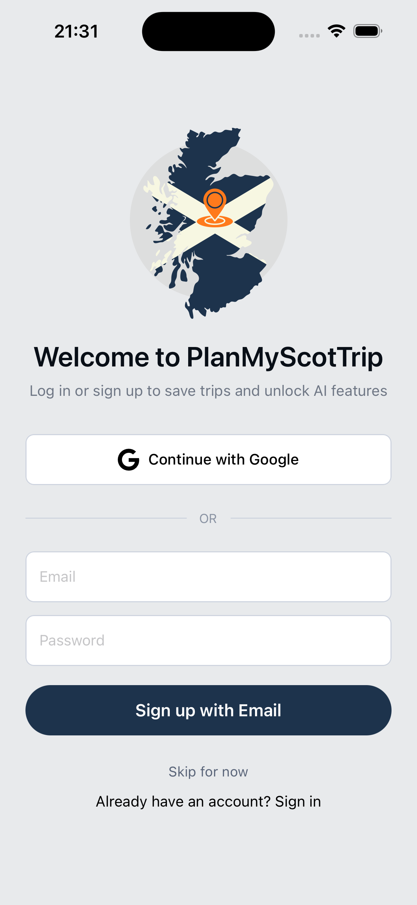
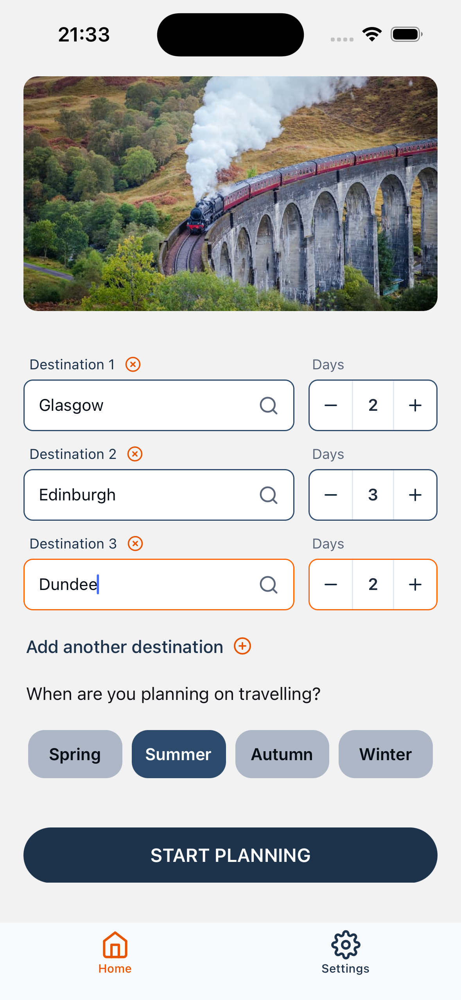
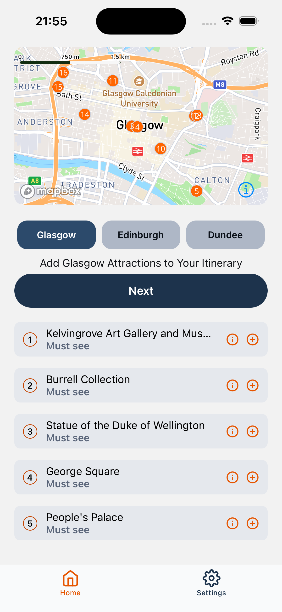
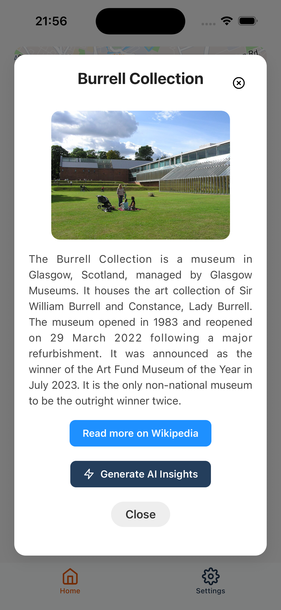
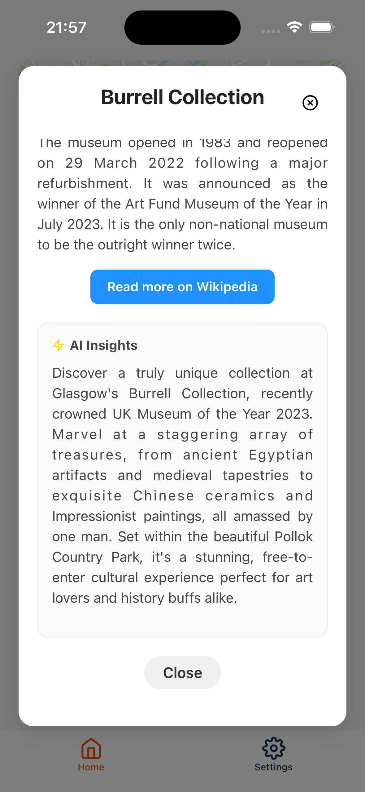
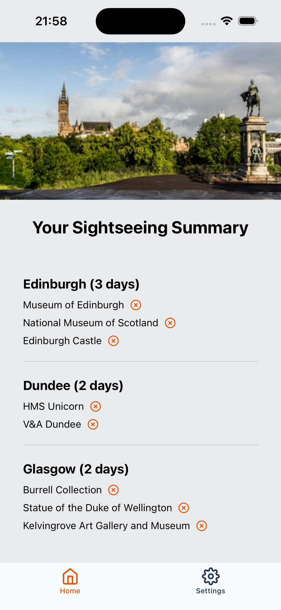
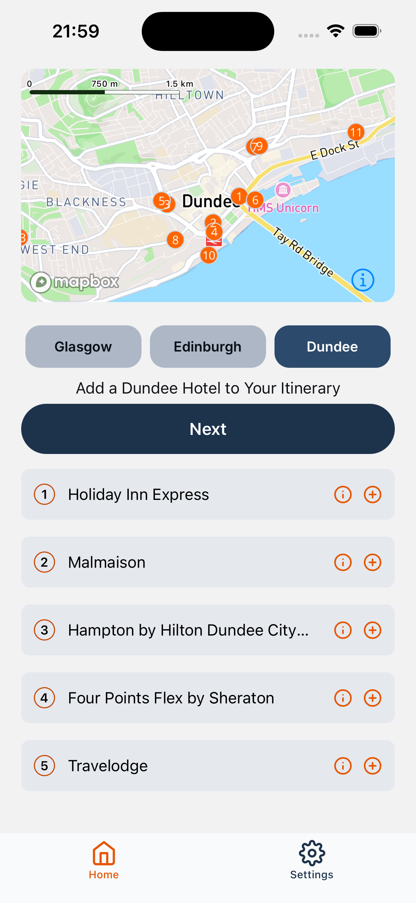
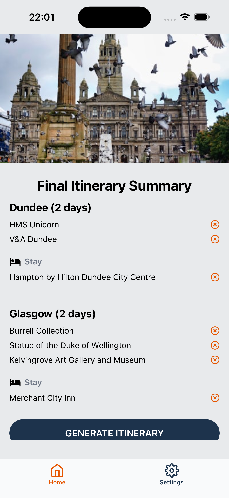
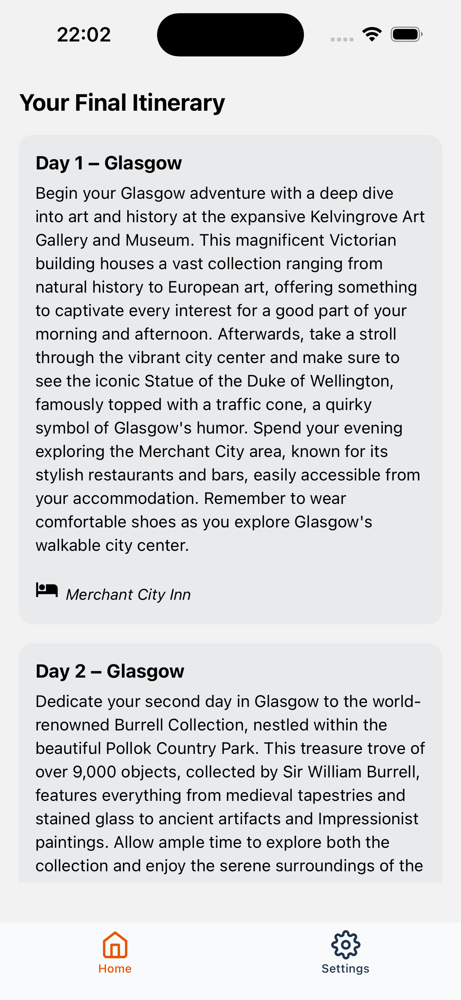

# PlanMyScotTrip

  
  
    

 
 

  
  
    

 
 

  
  
    

 
 
 

# Instructions for installing PlanMyScotTrip locally

## iOS setup

### Prerequisites

- Machine running MacOS 
- With Xcode with iOS simulator with a device configured
- VSCode (or similar IDE)
- Node.js installed

### Instructions

1.	Create and open a fresh folder and open in your IDE and terminal
2.	Run “git clone  https://github.com/ap-sullivan/travelPlannerHonours.git” to pull the latest repo from GitHub
3.	“cd” into the folder 
4.	Run “npm install” to install dependencies
5.	Once complete run “npx expo prebuild”
6.	Then “npx expo run:ios” to build a development version of the application for the simulator
7.	Run “npx expo start --dev-client” to start the application
8.	The simulator may open automatically, if not in the terminal hit “I” to open the simulator and the application

## Android setup

### Prerequisites

- Machine running Windows, macOS or linux 
- With Android Studio installed and an Emulator device configured
- VSCode (or similar IDE)
- Node.js installed

### Instructions

1.	Create and open a fresh folder and open in your IDE and terminal
2.	Run “git clone  https://github.com/ap-sullivan/travelPlannerHonours.git” to pull the latest repo from GitHub
3.	“cd” into the folder 
4.	Run “npm install” to install dependencies
5.	Once complete run “npx expo prebuild”
6.	Then “npx expo run:android” to build a development version of the application for the emulator to run
7.	Run “npx expo start --dev-client” to start the application
8.	The emulator may open automatically, if not in the terminal hit “a” to open the emulator and the application

### Environment Variables 

An .env file will need to be added with the keys given externally
To access AI features the functions need to be deployed
Run firebase deploy --only functions in CLI from the root folder to deploy these

